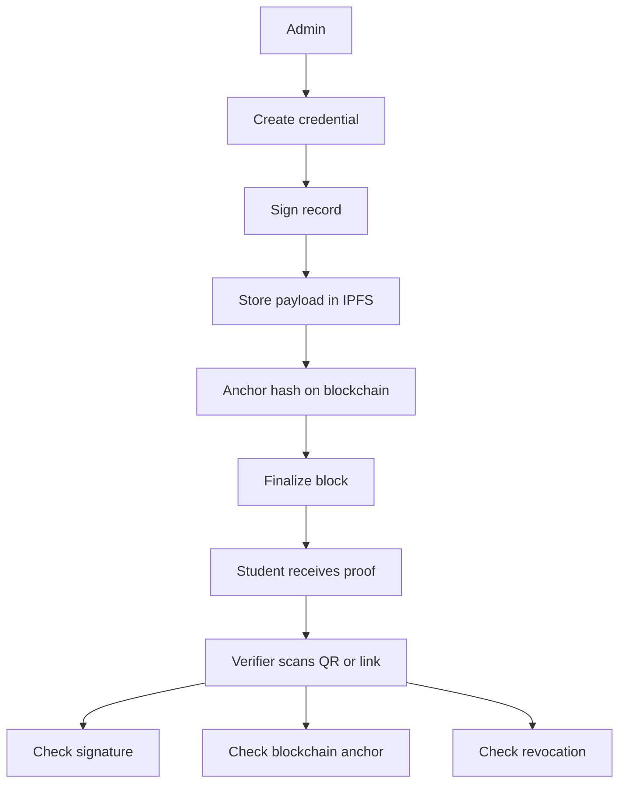
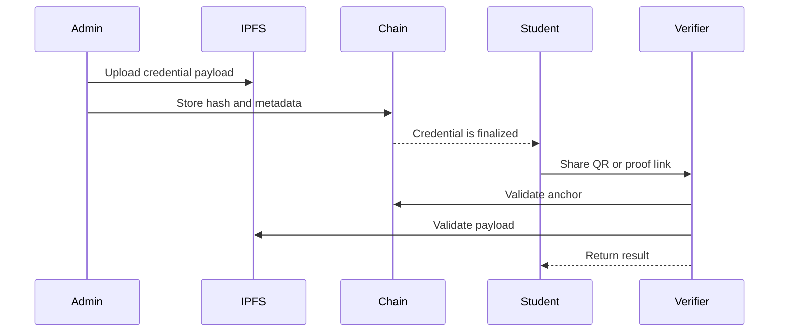

## CREDIFY

### A permissioned blockchain for academic credential verification

> Built solo to make credentials easier to issue, harder to fake, and faster to verify.

<p align="center">
  
  
  
  
  
</p>

## Overview

CREDIFY is a blockchain-based credential system for academic institutions, students, and verifiers.

It keeps credential records in a way that makes tampering obvious, verification fast, and trust easier to manage. Instead of relying on email threads, manual checks, and scattered record keeping, the system anchors proof on a permissioned blockchain and lets verifiers check authenticity directly.

## Why this exists

<div align="center">

<table>
  <tr>
    <th align="center">Problem</th>
    <th align="center">What usually happens</th>
    <th align="center">What CREDIFY does</th>
  </tr>
  <tr>
    <td align="center">Fake certificates</td>
    <td align="center">PDFs get copied or edited</td>
    <td align="center">Signs records and anchors them on-chain</td>
  </tr>
  <tr>
    <td align="center">Slow verification</td>
    <td align="center">Staff have to respond manually</td>
    <td align="center">Lets verifiers check proof directly</td>
  </tr>
  <tr>
    <td align="center">Scattered records</td>
    <td align="center">Data lives across different systems</td>
    <td align="center">Keeps the record flow structured</td>
  </tr>
  <tr>
    <td align="center">Trust gaps</td>
    <td align="center">No clear way to confirm origin</td>
    <td align="center">Uses permissions, hashes, and signatures</td>
  </tr>
</table>

</div>

## What it does

<div align="center">

<table>
  <tr>
    <th align="center">Part</th>
    <th align="center">What it handles</th>
  </tr>
  <tr>
    <td align="center">Issuance</td>
    <td align="center">Creates and signs credentials</td>
  </tr>
  <tr>
    <td align="center">Storage</td>
    <td align="center">Stores payloads through IPFS</td>
  </tr>
  <tr>
    <td align="center">Blockchain</td>
    <td align="center">Anchors hashes and keeps the ledger consistent</td>
  </tr>
  <tr>
    <td align="center">Verification</td>
    <td align="center">Checks signature, anchor, and revocation status</td>
  </tr>
  <tr>
    <td align="center">Access control</td>
    <td align="center">Uses OTP-based privileged access for issuer actions</td>
  </tr>
</table>

</div>

## Architecture



## How it works



## Key strengths

<div align="center">

<table>
  <tr>
    <th align="center">Strength</th>
    <th align="center">Why it matters</th>
  </tr>
  <tr>
    <td align="center">Permissioned network</td>
    <td align="center">Keeps validation controlled</td>
  </tr>
  <tr>
    <td align="center">Finalized blocks</td>
    <td align="center">Makes tampering obvious</td>
  </tr>
  <tr>
    <td align="center">Independent verification</td>
    <td align="center">Reduces manual follow-up</td>
  </tr>
  <tr>
    <td align="center">Selective disclosure</td>
    <td align="center">Shares only what is needed</td>
  </tr>
  <tr>
    <td align="center">Cryptographic proof</td>
    <td align="center">Gives verifiers something concrete to check</td>
  </tr>
</table>

</div>

## Quick start

### Docker

```bash
docker pull udaycodespace/credify:latest
docker run -d -p 5000:5000 udaycodespace/credify:latest
```

### Local setup

```bash
git clone https://github.com/udaycodespace/credify.git
cd credify
python -m venv venv

# Windows
venv\Scripts\activate

# Linux or macOS
source venv/bin/activate

pip install -r requirements.txt
cp .env.example .env
python main.py
```

### Validator nodes

```bash
docker-compose up -d
```

<div align="center">

<table>
  <tr>
    <th align="center">Node</th>
    <th align="center">Endpoint</th>
  </tr>
  <tr>
    <td align="center">Validator 1</td>
    <td align="center">http://localhost:5001</td>
  </tr>
  <tr>
    <td align="center">Validator 2</td>
    <td align="center">http://localhost:5002</td>
  </tr>
  <tr>
    <td align="center">Validator 3</td>
    <td align="center">http://localhost:5003</td>
  </tr>
</table>

</div>

## Tech stack

<div align="center">

<table>
  <tr>
    <th align="center">Area</th>
    <th align="center">Tools</th>
  </tr>
  <tr>
    <td align="center">Backend</td>
    <td align="center">Python, Flask, SQLAlchemy</td>
  </tr>
  <tr>
    <td align="center">Security</td>
    <td align="center">RSA, SHA-256</td>
  </tr>
  <tr>
    <td align="center">Storage</td>
    <td align="center">IPFS, SQLite, PostgreSQL</td>
  </tr>
  <tr>
    <td align="center">Deployment</td>
    <td align="center">Docker, Docker Compose</td>
  </tr>
  <tr>
    <td align="center">Automation</td>
    <td align="center">GitHub Actions</td>
  </tr>
</table>

</div>

## Security

<div align="center">

<table>
  <tr>
    <th align="center">Control</th>
    <th align="center">Purpose</th>
  </tr>
  <tr>
    <td align="center">OTP access</td>
    <td align="center">Protects issuer actions</td>
  </tr>
  <tr>
    <td align="center">RSA signatures</td>
    <td align="center">Proves record authenticity</td>
  </tr>
  <tr>
    <td align="center">SHA-256 hashing</td>
    <td align="center">Detects tampering</td>
  </tr>
  <tr>
    <td align="center">Role boundaries</td>
    <td align="center">Separates admin, student, verifier</td>
  </tr>
  <tr>
    <td align="center">Finalized ledger</td>
    <td align="center">Makes verification easier to trust</td>
  </tr>
</table>

</div>

## Roadmap

<div align="center">

<table>
  <tr>
    <th align="center">Next step</th>
    <th align="center">What it adds</th>
  </tr>
  <tr>
    <td align="center">PBFT-style consensus</td>
    <td align="center">Stronger validation model</td>
  </tr>
  <tr>
    <td align="center">DID support</td>
    <td align="center">Better identity interoperability</td>
  </tr>
  <tr>
    <td align="center">ZK proofs</td>
    <td align="center">More privacy for sensitive data</td>
  </tr>
  <tr>
    <td align="center">Governance controls</td>
    <td align="center">Cleaner validator management</td>
  </tr>
  <tr>
    <td align="center">Audit dashboards</td>
    <td align="center">Easier monitoring and traceability</td>
  </tr>
</table>

</div>

## Repo positioning

<div align="center">

<table>
  <tr>
    <th align="center">If you are...</th>
    <th align="center">CREDIFY gives you...</th>
  </tr>
  <tr>
    <td align="center">A student</td>
    <td align="center">A portable credential proof you can share quickly</td>
  </tr>
  <tr>
    <td align="center">An institution</td>
    <td align="center">A cleaner issuance and verification flow</td>
  </tr>
  <tr>
    <td align="center">A verifier</td>
    <td align="center">A direct way to confirm authenticity</td>
  </tr>
  <tr>
    <td align="center">A recruiter</td>
    <td align="center">A faster check than email-based validation</td>
  </tr>
</table>

</div>

## License

Copyright (c) 2026 Uday
All rights reserved.

<div align="center">
  <em>Built solo. Kept practical. Focused on trust, not hype.</em>
</div>
