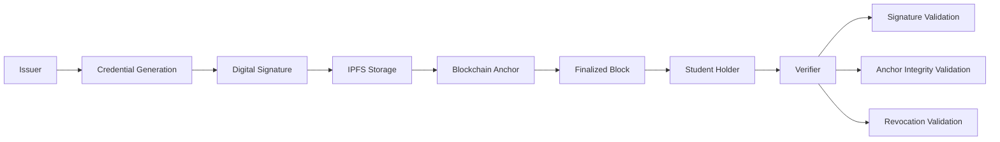
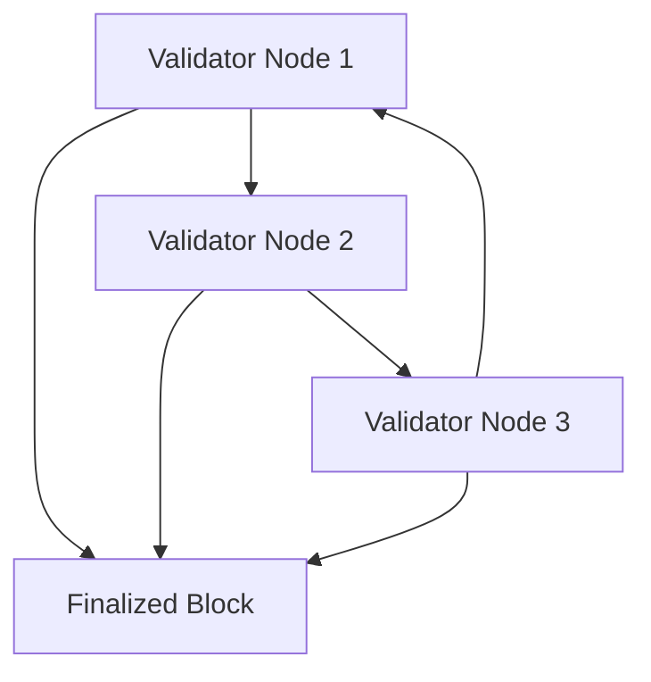
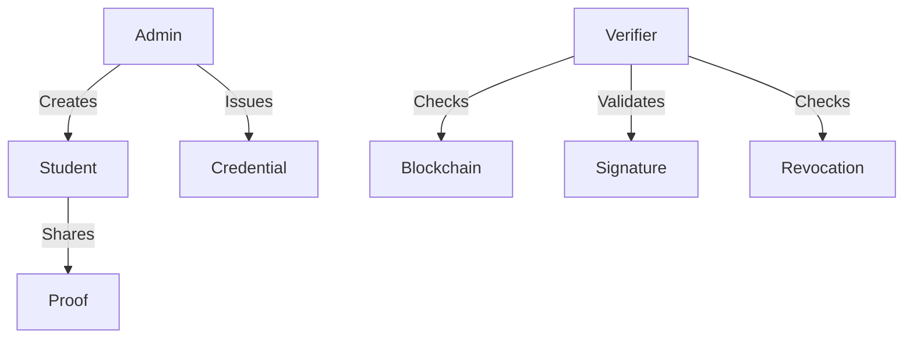
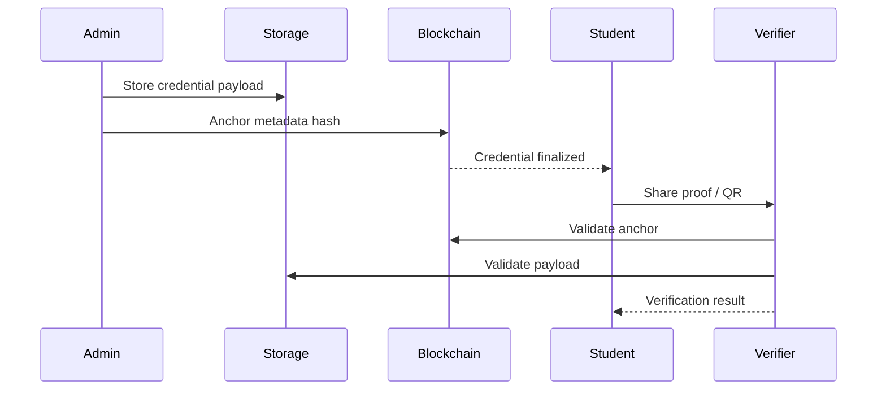

<div align="center">

<br/>

```txt
 ██████╗██████╗ ███████╗██████╗ ██╗███████╗██╗   ██╗
██╔════╝██╔══██╗██╔════╝██╔══██╗██║██╔════╝╚██╗ ██╔╝
██║     ██████╔╝█████╗  ██║  ██║██║█████╗   ╚████╔╝
██║     ██╔══██╗██╔══╝  ██║  ██║██║██╔══╝    ╚██╔╝
╚██████╗██║  ██║███████╗██████╔╝██║██║        ██║
 ╚═════╝╚═╝  ╚═╝╚══════╝╚═════╝ ╚═╝╚═╝        ╚═╝
```

### Permissioned Private Blockchain for Academic Credential Verification

<br/>

[](https://hub.docker.com/r/udaycodespace/credify)
[](https://github.com/udaycodespace/credify)
[](LICENSE)

<br/>

[](https://python.org)
[](https://flask.palletsprojects.com/)
[](https://ipfs.tech/)
[](https://docker.com)

<br/>

> **Controlled Trust · Deterministic Verification · Institutional Auditability**

> A permissioned blockchain infrastructure for secure academic credential issuance, verification, and tamper-evident record validation.

<br/>

[Overview](#-overview) •
[Architecture](#-system-architecture) •
[Workflow](#-workflow) •
[Security](#-security) •
[Quick Start](#-quick-start) •
[Roadmap](#-roadmap)

---

</div>

# 📘 Overview

> [!NOTE]
> Credify v2 is a permissioned blockchain platform designed to solve credential forgery, verification delays, and uncontrolled academic record exposure in traditional verification systems.

Traditional verification systems still rely heavily on:
- manual verification workflows
- institution-dependent approvals
- paper-based trust
- delayed verification cycles
- centralized record handling

Credify replaces that flow with:
- deterministic blockchain anchoring
- validator-controlled trust
- finalized tamper-evident blocks
- cryptographic proof validation
- selective credential disclosure

---

# 🎯 Stakeholder Outcomes

<table>
<tr>

<td width="33%" valign="top">

## 🏫 Institutions

- Issue signed credentials
- Maintain controlled trust boundaries
- Reduce manual verification overhead
- Preserve institutional auditability
- Track credential lifecycle events

</td>

<td width="33%" valign="top">

## 🎓 Students

- Own credential proofs
- Share records selectively
- Verify instantly using QR flows
- Avoid repetitive paperwork
- Access portable verification links

</td>

<td width="33%" valign="top">

## ✅ Verifiers

- Validate authenticity quickly
- Detect tampering immediately
- Verify without institution dependency
- Check revocation status
- Validate cryptographic signatures

</td>

</tr>
</table>

---

# ✨ Core Capabilities

<table>
<tr>

<td width="33%" valign="top">

## 🔗 Blockchain Layer

- Permissioned validator network
- Deterministic consensus sequencing
- Finalized tamper-evident blocks
- Multi-node propagation
- Hash-linked integrity model
- Validator participation controls

</td>

<td width="33%" valign="top">

## 🔐 Security Layer

- RSA-2048 digital signatures
- SHA-256 hashing
- OTP-based privileged access
- Revocation-aware verification
- Controlled access boundaries
- Validation pipelines

</td>

<td width="33%" valign="top">

## 📦 Credential Layer

- QR-based verification
- PDF credential generation
- Selective proof disclosure
- Student proof sharing
- Independent verification flows
- Blockchain anchor validation

</td>

</tr>
</table>

---

# 🏗️ System Architecture

> [!IMPORTANT]
> Credify prioritizes deterministic distributed behavior, institutional trust, explainability, and auditability over public-chain decentralization complexity.

---

## 🔄 High-Level Credential Lifecycle



---

## 🌐 Validator Network



---

## 🔐 Trust Boundary Model



---

# 🧠 Architecture Principles

<table>
<tr>
<th>Principle</th>
<th>Why It Exists</th>
</tr>

<tr>
<td><strong>Deterministic Consensus</strong></td>
<td>Removes probabilistic confirmation delays and creates predictable validator sequencing.</td>
</tr>

<tr>
<td><strong>Permissioned Validators</strong></td>
<td>Maintains institutional trust boundaries and prevents uncontrolled participation.</td>
</tr>

<tr>
<td><strong>Finalized Blocks</strong></td>
<td>Strengthens tamper evidence and reduces ambiguity in verification flows.</td>
</tr>

<tr>
<td><strong>Independent Verification</strong></td>
<td>Reduces operational coupling between issuance and verification systems.</td>
</tr>

<tr>
<td><strong>Selective Disclosure</strong></td>
<td>Allows proof validation without exposing unnecessary academic information.</td>
</tr>

</table>

---

# 🔄 System Evolution

## 🚧 Phase 1 — BlockCred Prototype

> [!NOTE]
> Initial prototype created to validate feasibility and core verification flows quickly.

### Foundations Introduced

- IPFS-based credential storage
- SHA-256 / Keccak hashing
- React dashboard workflows
- Dockerized deployment
- Initial credential anchoring

---

### Prototype Limitations

> [!WARNING]
> The prototype exposed architectural limitations in:
>
> - deterministic state progression
> - validator trust control
> - institutional audit guarantees
> - finalized verification guarantees
> - synchronization consistency

These limitations directly shaped the redesign into Credify v2.

---

## ⚡ Phase 2 — Credify v2

### Architectural Improvements

- Permissioned validator architecture
- Deterministic consensus sequencing
- Finalized tamper-evident blocks
- Validator orchestration model
- Multi-node synchronization support
- Stronger verification guarantees

---

## 🔎 Phase 3 — Verification Client

> [!TIP]
> Verification was intentionally separated into an independent trust boundary.

### Verification Client Characteristics

- Independent verification frontend
- QR-based proof validation
- No backend dependency during verification
- Reduced operational coupling
- Public verification accessibility

---

# 🔐 Authentication & Access Model

> [!NOTE]
> Credify follows institution-controlled onboarding rather than public self-registration.

---

<table>
<tr>

<td width="33%" valign="top">

## 👨‍💼 Admin / Issuer

### Responsibilities

- Create student identities
- Issue credentials
- Manage blockchain records
- Control onboarding lifecycle

### Access Model

- OTP-based authentication
- Privileged environment access
- Administrative issuance control

</td>

<td width="33%" valign="top">

## 🎓 Student

### Permissions

- View credentials
- Share proof references
- Access issued documents

### Restrictions

- No self-registration
- Cannot modify records
- Cannot issue credentials

</td>

<td width="33%" valign="top">

## ✅ Verifier

### Verification Methods

- QR verification
- Credential ID validation
- Proof verification

### Access Characteristics

- Public access
- No login required
- Read-only verification flows

</td>

</tr>
</table>

---

# ⚙️ Workflow

## 📌 Operational Lifecycle



---

# 🚀 Quick Start

## 🐳 Docker Deployment

> [!TIP]
> Recommended setup for validator synchronization demos and distributed-system evaluation.

```bash
docker pull udaycodespace/credify:latest
docker run -d -p 5000:5000 udaycodespace/credify:latest
```

### Application Endpoint

```txt
http://localhost:5000
```

---

## 🧪 Local Development

```bash
git clone https://github.com/udaycodespace/credify.git

cd credify

python -m venv venv

# Windows
venv\Scripts\activate

# Linux/macOS
source venv/bin/activate

pip install -r requirements.txt

cp .env.example .env

python main.py
```

---

## 🌐 Validator Cluster Deployment

```bash
docker-compose up -d
```

### Validator Endpoints

- http://localhost:5001
- http://localhost:5002
- http://localhost:5003

---

# 🛠️ Tech Stack

<div align="center">

## Backend

| Technology | Purpose |
|---|---|
| Python 3.10+ | Runtime |
| Flask | REST backend |
| SQLAlchemy | ORM & persistence |
| RSA Cryptography | Digital signatures |
| SHA-256 | Integrity hashing |

---

## Blockchain

| Technology | Purpose |
|---|---|
| Permissioned Ledger | Controlled validator trust |
| Deterministic Consensus | Predictable sequencing |
| Finalized Blocks | Tamper evidence |
| Validator Orchestration | Distributed synchronization |

---

## Storage

| Technology | Purpose |
|---|---|
| IPFS | Decentralized storage |
| SQLite/PostgreSQL | Persistence layer |
| Local Fallback | Reliability support |

---

## DevOps

| Technology | Purpose |
|---|---|
| Docker | Containerization |
| Docker Compose | Validator orchestration |
| GitHub Actions | CI/CD automation |

</div>

---

# 📂 Project Structure

```text
credify/
│
├── app/                 # Flask routes and services
├── core/                # Blockchain and cryptographic logic
├── data/                # Runtime storage artifacts
├── docs/                # Engineering documentation
├── static/              # Frontend assets
├── templates/           # HTML templates
├── tests/               # Automated tests
│
├── Dockerfile
├── docker-compose.yml
├── pyproject.toml
└── README.md
```

---

# 🧪 Testing

## Run Test Suite

```bash
pytest -v
```

---

## Coverage

```bash
pytest --cov=app --cov=core --cov-report=html
```

---

## Validation Areas

- authentication flows
- blockchain integrity
- validator synchronization
- consensus sequencing
- propagation consistency
- signature validation
- revocation verification

---

# 📦 Deployment Posture

> [!TIP]
> Suitable for:
>
> - academic demonstrations
> - institutional pilot environments
> - distributed systems showcases
> - blockchain engineering portfolios
> - verification workflow evaluation

---

## Environment Configuration

```env
SECRET_KEY=
OTP_SECRET=
DATABASE_URL=
IPFS_GATEWAY=
VALIDATOR_NODE_ID=
PEER_NODES=
```

---

# 🔒 Security

## Implemented Controls

<table>
<tr>
<th>Control</th>
<th>Purpose</th>
</tr>

<tr>
<td>OTP-based Privileged Access</td>
<td>Restricts administrative onboarding and issuance.</td>
</tr>

<tr>
<td>RSA Digital Signatures</td>
<td>Validates credential authenticity and integrity.</td>
</tr>

<tr>
<td>SHA-256 Hashing</td>
<td>Provides tamper-evident hashing guarantees.</td>
</tr>

<tr>
<td>Role-based Boundaries</td>
<td>Prevents unauthorized credential operations.</td>
</tr>

<tr>
<td>Finalized Block Model</td>
<td>Strengthens verification defensibility.</td>
</tr>

</table>

---

## Operational Recommendations

> [!WARNING]
> Production deployments should:
>
> - enforce HTTPS/TLS
> - rotate secrets regularly
> - isolate validator infrastructure
> - monitor verification failures
> - avoid default development secrets
> - separate staging and production validators

---

# 🛣️ Roadmap

## Planned Enhancements

- PBFT-style consensus evolution
- Validator governance controls
- Validator slashing mechanisms
- IPFS cluster integration
- DID interoperability
- Advanced zero-knowledge proof systems
- Distributed audit dashboards

---

# 👥 Team

## Core Contributors

<div align="center">

<table>
<tr>

<td align="center" width="33%">

<a href="https://github.com/udaycodespace">


### Uday
</a>

`Architecture`
`Blockchain`
`Backend`
`Integration`

💻 ⚡ 🔐

</td>

<td align="center" width="33%">

<a href="https://github.com/shashikiran47">


### Shashi
</a>

`Validation`
`Implementation`
`Testing`

🧪 💻 📖

</td>

<td align="center" width="33%">

<a href="https://github.com/tejavarshith">


### Varshith
</a>

`Debugging`
`Testing`
`Documentation`

🐛 🧪 📚

</td>

</tr>
</table>

</div>

---

# 🙌 Academic Guidance

> [!NOTE]
> This project was developed with academic mentorship and institutional guidance from faculty members at G. Pulla Reddy Engineering College (Autonomous), Kurnool.

<br/>

<div align="center">

| Faculty | Contribution |
|---|---|
| **Dr. B. Thimma Reddy Sir** | Distributed systems and engineering guidance |
| **Dr. G. Rajeswarappa Sir** | Academic evaluation and technical mentorship |
| **Shri K. Bala Chowdappa Sir** | Institutional support and project guidance |

</div>

---

# 🌍 Technical Ecosystem

- Python ecosystem
- Flask community
- IPFS contributors
- Open-source maintainers
- Cryptography libraries ecosystem

---

# 📜 License

> [!NOTE]
> Project classification: B.Tech Final Year Engineering Project.

Maintained for:
- academic evaluation
- blockchain engineering demonstration
- distributed systems showcase
- portfolio presentation

---

<div align="center">

<br/>

**Built as a flagship blockchain engineering project**

*If this project helped you, consider giving it a ⭐*

<br/>

[](https://skillicons.dev)

</div>
