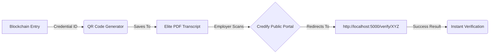

# 📊 Updated Credify Report Diagram Prompts (v2.0)

Use these prompts in Mermaid.ai or your preferred graphic tool.

---

### FIG 4.8: Internal Block Structure (JSON Snapshot)
**Tool:** Mermaid.ai
```mermaid
classDiagram
    class Block {
        +Integer index: 142
        +String timestamp: "2026-03-08T12:00:00Z"
        +String prev_hash: "0000a12b3c4d5e6f..."
        +String hash: "0000f98e7d6c5b4a..."
        +String cid: "QmXyz..."
        +Object data: {student_id: 121, name: "Uday"}
    }
```

---

### FIG 4.9: QR Code Integration & Verification Linkage
**Tool:** Mermaid.ai


---

### FIG 4.15: Success/Verification Result Badge
**Prompt for Napkin AI / Canva:**
"A professional green 'Verified' seal or badge with a security checkmark. It should look institutional-grade with subtle glowing background. Text: 'Authenticity Guaranteed by Credify Blockchain'. Subtext: 'Issuer: G. Pulla Reddy Engineering College'."

---

### 📷 New Screenshot Guide (Wrt Chapter 4 Refined)
For your report, the following screenshots will prove your project's depth:

1. **FIG 4.11 (Login):** Capture the `http://localhost:5000/login` screen.
2. **FIG 4.12 (Issuer Dashboard):** Capture the Admin Dashboard showing the "Issue Credential" form.
3. **FIG 4.13 (Student Dashboard):** Capture the view showing student credentials with the "Share" and "View Proof" buttons.
4. **FIG 4.14 (Verifier Dashboard):** Capture the result page when a verifier checks a valid ID.
5. **FIG 4.10 (Elite PDF):** Open one generated transcript and take a screenshot of the top half with the GPREC logo and QR code.

---
**Prepared For:** Credify 2026 Academic Report
**Project Name:** Credify - Blockchain-Based Verifiable Credential System
**Date:** March 2026
